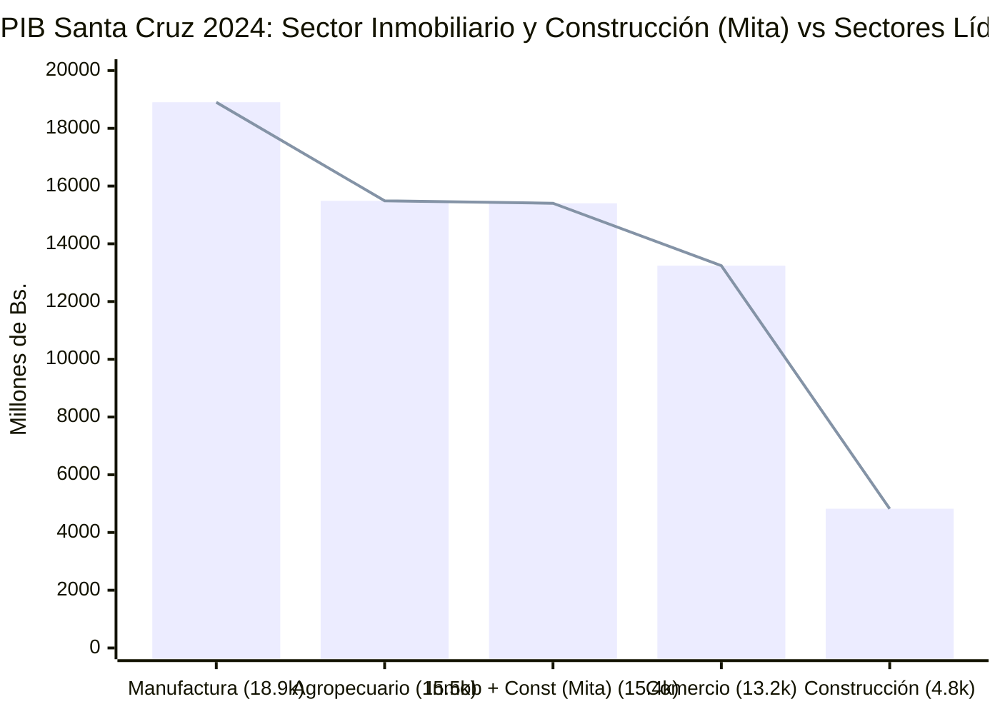
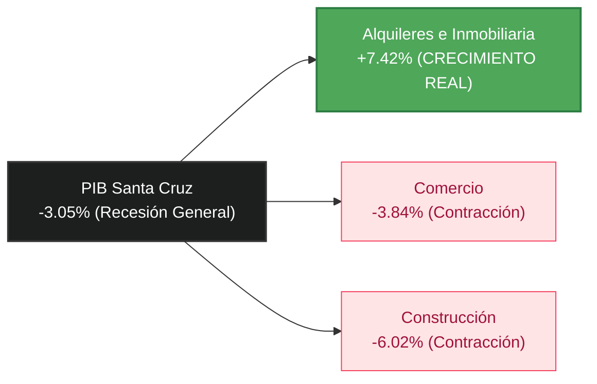
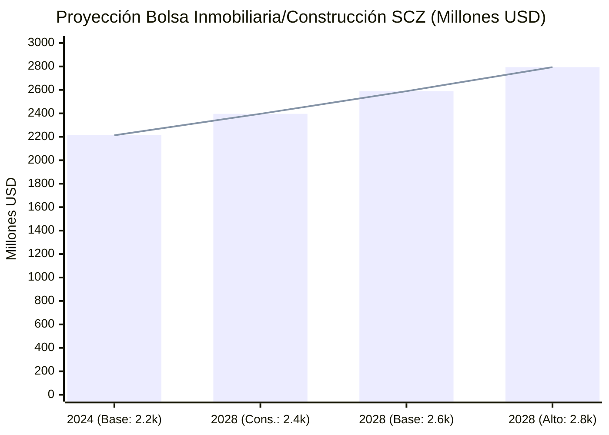
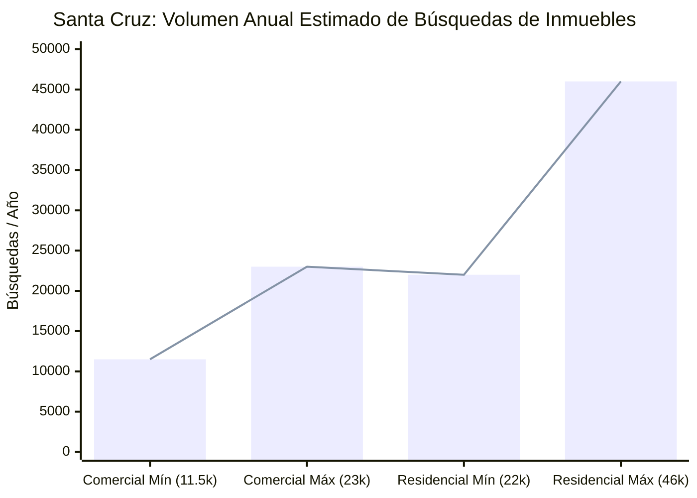
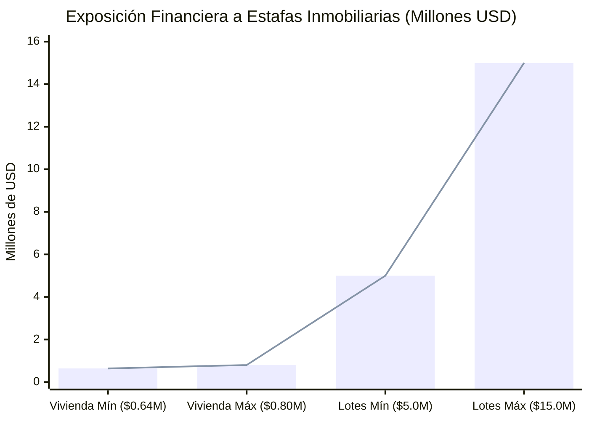
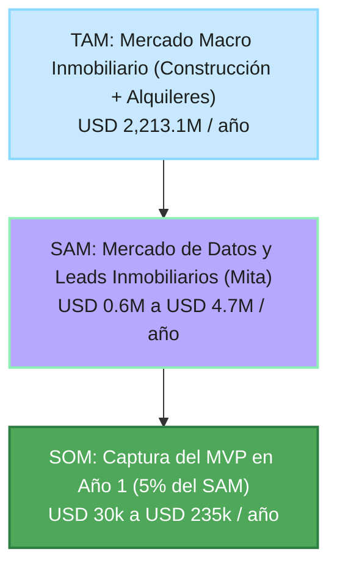
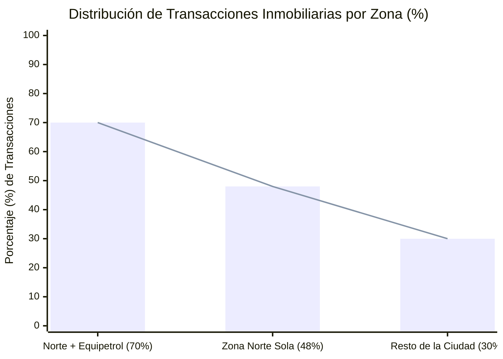

# Mita - Estadisticas de mercado, inferencias y argumentos fuertes

Fecha de investigacion: 2026-05-30

Este archivo convierte fuentes publicas en estadisticas accionables para el pitch de Mita. La regla es:

* **Dato observado:** cifra publicada por una fuente.
* **Inferencia Mita:** calculo propio a partir de datos observados.
* **Uso recomendado:** frase o grafica para pitch.

No presentar las inferencias como cifras oficiales. Presentarlas como estimaciones propias, con formula visible.

---

## 1. Tesis fuerte

Mita no ataca solo "buscar alquiler". Ataca una capa de informacion sobre una economia fisica grande:

> En Santa Cruz, construccion + actividades inmobiliarias, empresariales y de alquiler representan una bolsa economica estimada de **Bs 15.4 mil millones en 2024**, equivalente a **USD 2.21 mil millones** y **13.3% del PIB departamental**. Es casi tan grande como el agro cruceño y mayor que comercio.

Eso cambia la narrativa:

* No es un app de busqueda.
* Es infraestructura digital para decisiones sobre espacios.
* El mercado es grande, fragmentado, riesgoso y todavia poco estructurado.

---

## 2. Tamaño del mercado economico

### 2.1 Santa Cruz: bolsa inmobiliaria + construccion

**Dato observado INE Santa Cruz 2024:**

| Actividad | 2024, millones Bs | Participacion PIB SCZ |
| --- | ---: | ---: |
| PIB Santa Cruz | 115,658.2 | 100.0% |
| Actividades inmobiliarias, empresariales y de alquiler | 10,581.8 | 9.15% |
| Construccion | 4,821.7 | 4.17% |

**Inferencia Mita:**

```txt
Bolsa espacio/inmobiliaria SCZ =
Actividades inmobiliarias, empresariales y de alquiler + Construccion

= 10,581.8 + 4,821.7
= 15,403.5 millones Bs
= 2,213.1 millones USD, usando 6.96 Bs/USD
= 13.3% del PIB departamental
```

**Uso recomendado:**

> "Mita opera sobre una categoria de mas de USD 2.2 mil millones en Santa Cruz: el mercado fisico de espacios, alquileres, servicios inmobiliarios y construccion."

### 2.2 Comparación contra otras industrias en Santa Cruz

---

#### 🖵 Diapositiva: El mercado físico es masivo (Comparación Sectorial)

> **Mensaje de Apertura (Hook):** *"Cuando pensamos en el sector inmobiliario, solemos pensar en una aplicación móvil para buscar departamentos. Pero en realidad, la economía de espacios físicos en Santa Cruz es una fuerza industrial gigantesca: es casi del tamaño del sector agropecuario completo y es más grande que todo el sector comercial departamental."*

**Datos de Actividad Económica (INE Santa Cruz 2024):**

| Actividad | Millones Bs (2024) | Relación vs. Bolsa de Espacios (Mita) |
| :--- | :---: | :--- |
| **Industrias Manufactureras** | 18,901.9 | Bolsa Mita equivale al **81.5%** de Manufactura |
| **Agricultura, Ganadería, Caza, Silvicultura y Pesca** | 15,487.7 | Bolsa Mita equivale al **99.5%** del Agro Cruceño |
| **Bolsa Inmobiliaria + Construcción (Mita)** | **15,403.5** | **Base de comparación (100%)** |
| **Comercio** | 13,242.9 | Bolsa Mita es **1.16 veces** (+16.3%) el Comercio |
| **Construcción** | 4,821.7 | Subcomponente de la Bolsa Mita (31.3%) |

**Fórmulas e Inferencias de Mercado:**
```txt
Bolsa Mita (Construcción + Inmobiliarias y Alquileres) = Bs 15,403.5 millones (USD 2,213 millones)
Relación vs. Agropecuario: Bs 15,403.5M / Bs 15,487.7M = 99.46% (Casi idéntico)
Relación vs. Comercio: Bs 15,403.5M / Bs 13,242.9M = 116.31% (+16.3% más grande que comercio)
```




**💡 Insights Estratégicos para el Pitch:**
*   **Escala Macroeconómica:** Mita no es un negocio de nicho. Opera y optimiza la información sobre una bolsa económica de más de **USD 2.2 mil millones** en Santa Cruz, equivalente al **13.3% del PIB departamental**.
*   **Oportunidad B2B:** Al estructurar los datos del sector de construcción y alquiler comercial/logístico, impactamos transversalmente a las pymes y constructoras que motorizan la economía cruceña.

**📌 Fuente:** Elaboración propia de Mita basada en el reporte del Producto Interno Bruto Departamental por Actividad Económica (2017-2024) del **Instituto Nacional de Estadística (INE) de Bolivia** ([INE Santa Cruz - PIB D.7.1.1](https://www.ine.gob.bo/referencia2017/CUADROS/D.7.1.1.xlsx)).

---

### 2.3 Bolivia: tamaño nacional de la oportunidad

**Dato observado INE Bolivia 2024:**

| Actividad | 2024, millones Bs | Participacion PIB basico |
| --- | ---: | ---: |
| PIB a precios basicos | 275,535.8 | 100.0% |
| Inmuebles y servicios prestados a las empresas | 33,749.8 | 12.25% |
| Construccion | 9,325.4 | 3.38% |
| Industrias manufactureras | 33,192.3 | 12.05% |
| Comercio | 23,158.6 | 8.40% |

**Inferencia Mita nacional:**

```txt
Bolsa espacio/inmobiliaria Bolivia =
33,749.8 + 9,325.4
= 43,075.2 millones Bs
= 6,189.0 millones USD
= 15.63% del PIB basico
= 1.30x manufactura
= 1.86x comercio
```

**Uso recomendado:**

> "A nivel Bolivia, la bolsa inmobiliaria/espacios + construccion supera a manufactura y casi duplica comercio en valor agregado."

---

## 3. Crecimiento y ciclo

### 3.1 Santa Cruz: el espacio crece aunque el ciclo esté duro

---

#### 🖵 Diapositiva: Resiliencia del Sector en Tiempos de Crisis (Crecimiento Real)

> **Mensaje de Apertura (Hook):** *"Muchos inversores temen que la ralentización económica afecte a nuestro producto. La realidad es que las crisis aceleran la necesidad de Mita. Mientras el PIB general de Santa Cruz cayó un 3% y la construcción retrocedió un 6%, las actividades inmobiliarias y de alquiler crecieron un 7.4% real. Cuando la construcción se detiene, la eficiencia en el uso de los espacios existentes se vuelve crítica."*

**Tasa de Variación Real del PIB (INE Santa Cruz 2024):**

| Actividad Económica | Variación Real (%) 2024 | Comportamiento del Sector |
| :--- | :---: | :--- |
| **Inmobiliarias, Empresariales y Alquiler** | **+7.42%** | **Crecimiento acelerado y contracíclico** |
| Manufactura | -1.88% | Contracción leve |
| **PIB Total de Santa Cruz** | **-3.05%** | **Recesión general departamental** |
| Comercio | -3.84% | Contracción moderada |
| **Construcción** | **-6.02%** | **Caída fuerte en obra nueva** |

**Inferencia de Mercado (Mita):**
La edificación de nuevas obras está fuertemente golpeada por los costos de materiales y la escasez de divisas. Sin embargo, esto empuja a las empresas y personas a **renegociar, subalquilar, reubicarse o buscar espacios comerciales existentes más eficientes**. La rotación del inventario existente se dinamiza, multiplicando la necesidad de búsquedas estructuradas y veloces.




**💡 Insights Estratégicos para el Pitch:**
*   **Oportunidad Anticíclica:** El negocio de Mita no depende de que el sector inmobiliario construya más metros, sino del volumen de transacciones de uso (alquileres, traspasos, optimización de espacios) que crece en momentos de ajuste.
*   **El dolor es la información:** En un mercado dinámico pero estresado, la demanda existe, pero se pierde tiempo y dinero buscando opciones en canales informales desorganizados.

**📌 Fuente:** Datos oficiales de variación porcentual real por actividad económica del **Instituto Nacional de Estadística (INE) de Bolivia** ([INE Santa Cruz - Variación Real PIB D.7.2.3](https://www.ine.gob.bo/referencia2017/CUADROS/D.7.2.3.xlsx)).

---

### 3.2 Tendencia nominal 2017-2024

**Dato observado INE Santa Cruz:**

| Actividad | 2017, millones Bs | 2024, millones Bs | CAGR nominal 2017-2024 |
| --- | ---: | ---: | ---: |
| PIB Santa Cruz | 95,419.7 | 115,658.2 | +2.79% |
| Actividades inmobiliarias, empresariales y de alquiler | 7,827.6 | 10,581.8 | +4.40% |
| Construccion | 5,415.9 | 4,821.7 | -1.65% |
| Comercio | 10,568.9 | 13,242.9 | +3.27% |
| Manufactura | 13,634.7 | 18,901.9 | +4.78% |

**Inferencia Mita:**

Las actividades inmobiliarias/empresariales/alquiler crecieron mas rapido que el PIB departamental entre 2017 y 2024.

---

## 4. Proyección 2028 de la bolsa Mita en Santa Cruz

---

#### 🖵 Diapositiva: Tamaño del Mercado al 2028 (Proyección CAGR)

> **Mensaje de Apertura (Hook):** *"Proyectando a mediano plazo, incluso bajo un escenario de crecimiento conservador del 2% anual, la bolsa económica de espacios físicos en Santa Cruz superará los USD 2,390 millones para 2028. En un escenario base del 4%, la categoría alcanzará casi USD 2,600 millones. Mita se posiciona para organizar digitalmente un mercado en expansión constante."*

**Escenarios de Proyección a 4 Años (Base 2024: Bs 15,403.5 millones / USD 2,213.1 millones):**

| Escenario | CAGR Proyectada | Bolsa 2028 (Millones Bs) | Bolsa 2028 (Millones USD) | Incremento vs. 2024 |
| :--- | :---: | :---: | :---: | :--- |
| **Conservador** | **2.0%** | 16,673.3 | **2,395.6** | + USD 182.5M |
| **Base (Normalizado)** | **4.0%** | 18,019.9 | **2,589.1** | + USD 376.0M |
| **Alto Crecimiento** | **6.0%** | 19,446.6 | **2,794.0** | + USD 580.9M |

*Nota: Tipo de cambio de cálculo estático: 6.96 Bs/USD (oficial).*

**Inferencia y Modelo de Proyección:**
El crecimiento del sector inmobiliario y de servicios ha mostrado un CAGR nominal promedio de +4.40% entre 2017 y 2024. Por lo tanto, el escenario **Base (4.0%)** representa una trayectoria realista y justificada históricamente si se estabilizan los flujos macroeconómicos locales.



**💡 Insights Estratégicos para el Pitch:**
*   **Mercado en Expansión:** El volumen de negocio físico sobre el cual Mita actúa sumará entre **USD 180 millones y USD 580 millones** de valor anualizado adicional en los próximos cuatro años.
*   **Digitalización Impostergable:** A mayor volumen físico y transaccional, mayor es la fricción de búsqueda si se mantiene en canales analógicos e informales.

**📌 Fuente:** Modelo predictivo financiero Mita en base a la serie histórica nominal 2017-2024 del PIB de Santa Cruz del **Instituto Nacional de Estadística (INE)** ([INE Santa Cruz - PIB D.7.1.1](https://www.ine.gob.bo/referencia2017/CUADROS/D.7.1.1.xlsx)).

---

---

## 5. Demanda anual: cuantas busquedas puede ordenar Mita

### 5.1 Empresas que potencialmente necesitan espacios

**Dato observado SEPREC 2024:**

* Base empresarial Bolivia: 387,764 unidades economicas.
* Santa Cruz concentra 29.7%.
* Nuevas empresas Bolivia 2024: 15,001.
* Santa Cruz lidera nuevas inscripciones con 32.5%, equivalente a 4,872 segun SEPREC.

**Inferencia Mita:**

```txt
Empresas activas aproximadas en Santa Cruz =
387,764 * 29.7%
= 115,166 unidades economicas

Nuevas empresas Santa Cruz 2024 =
15,001 * 32.5%
= 4,875 nuevas empresas/año
= 13.4 nuevas empresas/dia
```

No todas necesitan local fisico. Escenarios:

| Supuesto | Busquedas comerciales/productivas por año |
| --- | ---: |
| 10% de empresas activas buscan, abren, relocalizan o comparan espacio | 11,517 |
| 15% | 17,275 |
| 20% | 23,033 |

**Uso recomendado:**

> "Solo con empresas formales, Santa Cruz puede generar entre 11 mil y 23 mil decisiones de espacio comercial/productivo al año."

### 5.2 Vivienda y alquiler como extension natural

**Dato observado ICE / Censo 2024 citado en prensa:**

* Santa Cruz de la Sierra: 662,680 viviendas.
* Region metropolitana: 827,408 viviendas.
* En Santa Cruz de la Sierra, 27.74% vive en alquiler.
* En la region metropolitana, 25.5% vive en alquiler.

**Inferencia Mita:**

```txt
Viviendas alquiladas ciudad SCZ =
662,680 * 27.74%
= 183,827 viviendas alquiladas

Viviendas alquiladas region metropolitana =
827,408 * 25.5%
= 210,989 viviendas alquiladas
```

Si 12%-25% de hogares alquilados cambian o buscan opcion cada año:

| Supuesto de rotacion anual | Busquedas residenciales/año, ciudad SCZ |
| --- | ---: |
| 12% | 22,059 |
| 15% | 27,574 |
| 20% | 36,765 |
| 25% | 45,957 |

### 5.3 Mercado anual de búsquedas Mita

---

#### 🖵 Diapositiva: Volumen de Demanda Anual (Transacciones de Información)

> **Mensaje de Apertura (Hook):** *"¿Cuántas decisiones de espacio comercial, corporativo y residencial ocurren cada año en Santa Cruz? Estimamos que se realizan entre 33,500 y 69,000 búsquedas anuales importantes en la ciudad. Esto representa miles de personas y pymes negociando, comparando y perdiéndose en la dispersión de datos todos los días. Mita organiza y monetiza este flujo transaccional."*

**Estimación de Búsquedas e Interacciones Anuales de Espacio (Santa Cruz):**

| Segmento de Demanda | Supuesto de Rotación Anual | Búsquedas/Año (Límite Bajo) | Búsquedas/Año (Límite Alto) | Base de Cálculo |
| :--- | :---: | :---: | :---: | :--- |
| **Comercial / Productivo** | **10% - 20%** de pymes buscan local/oficina/galpón | 11,517 | 23,033 | 115,166 empresas activas registradas en Santa Cruz (SEPREC 2024) |
| **Residencial (Vivienda)** | **12% - 25%** de hogares en alquiler rotan de casa | 22,059 | 45,957 | 183,827 viviendas alquiladas en la ciudad de Santa Cruz (Censo INE 2024) |
| **Total Mercado (Decisiones/Año)** | **Decisiones de espacio anuales** | **33,576** | **68,990** | **Suma combinada de ambos segmentos** |




**💡 Insights Estratégicos para el Pitch:**
*   **Gran Capacidad de Captación:** Solo en el segmento comercial e industrial de pymes (locales, oficinas, galpones y talleres), ocurren entre **11,000 y 23,000 búsquedas al año**. Estos clientes B2B están dispuestos a pagar para encontrar el espacio ideal de producción y venta con criterios operativos claros.
*   **Velocidad de Intermediación:** Al concentrar y estructurar la intención de búsqueda, Mita reduce el tiempo promedio de toma de decisiones de semanas a minutos.

**📌 Fuente:** Cruce de base de datos de empresas activas de la memoria del **Servicio Estatal de Registro de Comercio (SEPREC) 2024** ([SEPREC Memoria 2024](https://www.seprec.gob.bo/wp-content/uploads/2025/10/Memoria-ANUAL-2024-2.pdf)) y resultados de vivienda del **Censo de Población y Vivienda 2024 del INE** citados por prensa especializada ([El Deber - Alquileres Santa Cruz](https://eldeber.com.bo/santa-cruz/la-capital-crucena-cuenta-con-662680-viviendas-de-las-cuales-un-2774-son-alquiladas_514844/)).

---

---

## 6. Agentes inmobiliarios: red formal e independiente

### 6.1 Conteos observables

**Datos observados:**

* Century 21 Global lista **1,562 agentes** en Santa Cruz, Bolivia.
* CBDI Santa Cruz reporta que agrupa a **88 empresas desarrolladoras inmobiliarias** asociadas.
* RE/MAX Bolivia reporta una red nacional con oficinas y agentes asociados; una fuente sectorial reportaba 26 oficinas y mas de 300 agentes a nivel Bolivia en 2020.

**Inferencia Mita:**

El mercado no depende de una sola red. Hay:

* agentes de franquicia,
* brokers,
* asesores de desarrolladoras,
* inmobiliarias pequeñas,
* propietarios recurrentes,
* intermediarios independientes en Facebook/WhatsApp.

Escenarios defendibles para Santa Cruz:

| Categoria | Rango estimado | Razonamiento |
| --- | ---: | --- |
| Agentes visibles/formales en redes y agencias | 2,000 - 3,500 | Century 21 ya lista 1,562; se agregan otras redes, oficinas, agencias y desarrolladoras. |
| Intermediarios independientes o semi-formales | 1,500 - 3,500 | El mercado usa Facebook, WhatsApp y contactos personales; parte de la intermediacion no aparece en directorios. |
| Total agentes/intermediarios activos potenciales | 3,500 - 7,000 | Rango para dimensionar mercado B2B de Mita, no como dato oficial. |

**Densidad inferida:**

| Escenario | Agentes/intermediarios | Por 100,000 habitantes SCZ | Viviendas ciudad por agente |
| --- | ---: | ---: | ---: |
| Directorio Century 21 observado | 1,562 | 50.0 | 424 |
| Estimacion baja | 3,500 | 112.1 | 189 |
| Estimacion alta | 7,000 | 224.2 | 95 |

**Uso recomendado:**

> "Incluso tomando solo el directorio visible de Century 21, Santa Cruz ya muestra mas de 1,500 agentes. El mercado B2B de herramientas para agentes existe antes de escalar a toda Bolivia."

### 6.2 Dependientes vs independientes

No encontre un registro publico oficial de "agentes inmobiliarios dependientes vs independientes" para Santa Cruz.

**Inferencia Mita basada en modelo de negocio del sector:**

* Agentes dependientes o asalariados: **10%-25%**.
* Agentes independientes, comisionistas, franquiciados o semi-formales: **75%-90%**.

Formula de escenario sobre 3,500-7,000 agentes:

| Tipo | Rango estimado |
| --- | ---: |
| Dependientes / staff comercial fijo | 350 - 1,750 |
| Independientes / comisionistas / semi-formales | 2,625 - 6,300 |

**Uso recomendado:**

> "El cliente B2B natural de Mita no es solo la inmobiliaria grande; son miles de agentes que viven de leads, confianza y velocidad de respuesta."

---

## 7. Riesgo y estafas inmobiliarias

### 7.1 Casos publicos usados como lower bound

**Dato observado 1: caso de viviendas en Santa Cruz, 2024**

Medios reportaron 32 denuncias por presunta estafa vinculada a viviendas en Santa Cruz. Las victimas habrian entregado entre USD 20,000 y USD 25,000 cada una.

**Inferencia Mita:**

```txt
Exposicion minima caso 32 victimas =
32 * USD 20,000 = USD 640,000

Exposicion alta del mismo caso =
32 * USD 25,000 = USD 800,000
```

**Dato observado 2: urbanizacion/lotes en Santa Cruz**

Medios reportaron una urbanizacion con mas de 1,000 lotes presuntamente vendidos de forma irregular.

**Inferencia Mita:**

Como el precio por lote no esta reportado de forma uniforme, usar escenarios:

| Supuesto precio promedio por lote | Exposicion potencial |
| --- | ---: |
| USD 5,000 | USD 5.0 millones |
| USD 10,000 | USD 10.0 millones |
| USD 15,000 | USD 15.0 millones |

### 7.2 Índice Mita de exposición visible a fraude

---

#### 🖵 Diapositiva: El Costo del Riesgo y la Falta de Verificación

> **Mensaje de Apertura (Hook):** *"En Santa Cruz, buscar espacios sin información verificada no solo es ineficiente: es financieramente peligroso. Tomando únicamente dos casos judiciales de estafas inmobiliarias reportados en los medios durante 2024, la exposición financiera al fraude oscila entre USD 5.6 millones y USD 15.8 millones. Mita protege a los usuarios alertando sobre inconsistencias y publicaciones sospechosas antes de iniciar el contacto."*

**Exposición Financiera Estimada en Casos de Fraude Inmobiliario (Santa Cruz 2024):**

| Caso Reportado en Prensa | Parámetros del Fraude | Exposición Mínima (USD) | Exposición Máxima (USD) | Detalle del Caso Judicial |
| :--- | :--- | :---: | :---: | :--- |
| **Fraude en Viviendas** | 32 víctimas con adelantos de USD 20,000 - 25,000 | **$640,000** | **$800,000** | Estafa organizada de alquileres y anticréticos falsificados en la capital. |
| **Loteamientos Irregulares** | 1,000 terrenos vendidos sin títulos (USD 5k - 15k c/u) | **$5,000,000** | **$15,000,000** | Venta de lotes ilegales en zonas de expansión urbana sin planos aprobados. |
| **Total Exposición Visible** | **Cálculo de Lower Bound (Prensa)** | **$5,640,000** | **$15,800,000** | **Base de riesgo mínimo expuesta judicialmente.** |



**💡 Insights Estratégicos para el Pitch:**
*   **La IA como filtro de confianza:** Mita no realiza auditorías legales complejas, pero su motor de IA detecta señales de alerta tempranas (redacción idéntica de estafas conocidas, precios absurdamente bajos para la zona, falta de m2 especificados, números telefónicos sospechosos o inconsistencias geográficas).
*   **Reducción del Costo de Confianza:** La seguridad del dato es una propuesta de valor de alto impacto en países con un 85% de empleo informal.

**📌 Fuente:** Compilación de notas de prensa judicializadas en Santa Cruz de la Sierra: 32 denuncias de viviendas ([Unitel - Estafas Viviendas](https://unitel.bo/noticias/seguridad/hay-32-denuncias-por-presunta-estafa-de-viviendas-en-santa-cruz-BC12247131)) y urbanización irregular de 1,000 lotes ([El Día - Urbanizaciones Ilegales](https://eldia.com.bo/2024-07-16/sociedad/denuncian-a-una-urbanizacion-con-1000-lotes-ilegales-en-santa-cruz.html)).

---

### 7.3 Como conecta con Mita

Mita no promete eliminar fraude legal. Pero puede reducir riesgo de informacion:

* alertar publicaciones sin datos clave,
* marcar falta de ubicacion clara,
* pedir documentos minimos antes de contacto,
* detectar inconsistencias de precio/zona/metros,
* separar fuente verificada de fuente no verificada,
* registrar trazabilidad de publicacion,
* generar checklist antes de pagar reserva, anticretico o adelanto.

---

## 8. NPS, satisfaccion y friccion de confianza

### 8.1 Lo que existe y lo que no existe

No encontre una fuente publica robusta con NPS especifico de inmobiliarias o agentes inmobiliarios en Santa Cruz/Bolivia.

Fuentes internacionales si muestran que la confianza, comunicacion y transparencia son variables criticas en la relacion cliente-agente. Tambien existen benchmarks externos donde la profesion de agente inmobiliario aparece con NPS bajo o reputacion tensionada, pero no deben presentarse como dato boliviano.

### 8.2 Proxy Mita de NPS de experiencia inmobiliaria

Para pitch se puede usar como **hipotesis cuantitativa a validar**, no como dato oficial:

```txt
NPS = % promotores - % detractores
```

Escenarios de experiencia de busqueda inmobiliaria en Santa Cruz:

| Escenario | Promotores | Pasivos | Detractores | NPS proxy |
| --- | ---: | ---: | ---: | ---: |
| Moderadamente frustrado | 25% | 35% | 40% | -15 |
| Friccion alta | 20% | 30% | 50% | -30 |
| Baja confianza | 15% | 30% | 55% | -40 |

**Uso recomendado:**

> "Nuestra hipotesis es que la experiencia actual de busqueda inmobiliaria tiene NPS negativo por informacion incompleta, tiempo perdido y baja confianza. Mita busca mover esa experiencia de -30 a positiva."

### 8.3 Mita Trust Friction Index

Indice propio de 0 a 100 para medir friccion antes/despues del producto.

Variables:

| Variable | Peso | Medicion |
| --- | ---: | --- |
| Publicacion incompleta | 25 | % sin m2, condiciones, zona exacta, servicios o uso permitido |
| Riesgo de fuente | 20 | fuente no verificada, duplicada o sin trazabilidad |
| Costo de comparacion | 20 | numero de publicaciones revisadas/manualidad |
| Claridad de contacto | 15 | WhatsApp/contacto verificable, respuesta, identidad |
| Compatibilidad con necesidad | 20 | si el espacio realmente sirve para el uso declarado |

**Formula:**

```txt
Trust Friction Index =
0.25*Incompletitud +
0.20*RiesgoFuente +
0.20*CostoComparacion +
0.15*ClaridadContactoInvertida +
0.20*NoCompatibilidad
```

**Hipotesis inicial para auditoria propia:**

* Mercado actual: 65-80/100 friccion.
* Con Mita MVP: 25-40/100 friccion.

La auditoria de 50-100 publicaciones debe llenar los valores reales.

---

## 9. TAM, SAM y monetizacion defendible

### 9.1 TAM macro local

**TAM macro Santa Cruz:**

```txt
Construccion + inmobiliarias/empresariales/alquiler =
USD 2.21 mil millones en 2024
```

Este TAM no es ingreso capturable por Mita. Es la economia sobre la que Mita organiza informacion.

### 9.2 SAM de capa digital/IA

Estimacion de ingresos anuales si Mita monetiza agentes, leads y publicaciones:

| Linea | Supuesto | SAM anual Santa Cruz |
| --- | --- | ---: |
| SaaS para agentes | 3,500-7,000 agentes * USD 10-30/mes | USD 420k - 2.52M |
| Leads calificados | 33,500-69,000 busquedas/año * 1.5-3 contactos * USD 3-10/lead | USD 151k - 2.07M |
| Mejora de publicaciones | 10,000-30,000 publicaciones/año * USD 1-5 | USD 10k - 150k |

**SAM local combinado estimado:**

```txt
USD 0.6M - 4.7M/año
```

**SOM inicial realista para MVP/post-hackathon:**

| Captura | Ingreso anual potencial |
| --- | ---: |
| 1% del SAM bajo | USD 6k/año |
| 5% del SAM bajo | USD 30k/año |
| 10% del SAM bajo | USD 60k/año |
| 5% del SAM alto | USD 235k/año |
| 10% del SAM alto | USD 470k/año |

**Uso recomendado:**

> "El mercado macro es de miles de millones, pero el negocio inicial de Mita es una capa digital de leads, confianza y datos: entre USD 0.6M y 4.7M anuales solo en Santa Cruz si logra adopcion B2B."

---

## 10. Gráficas que conviene llevar al deck

En esta sección se consolidan los visuales de datos clave listos para incorporarse al Pitch Deck, facilitando la narrativa de inversión y validación del problema.

### Gráfica A - Escala Industrial del Mercado (TAM Macro)
*   **Ubicación de origen:** Sección 2.2.
*   **Mensaje Clave:** *"La economía física de espacios en Santa Cruz es gigantesca, representando el 13.3% del PIB departamental. Es del tamaño del sector agropecuario y más grande que el comercio."*

### Gráfica B - Resiliencia en Épocas de Ajuste (Demanda Contracíclica)
*   **Ubicación de origen:** Sección 3.1.
*   **Mensaje Clave:** *"Aunque el PIB se contraiga, el mercado inmobiliario transaccional y de servicios de alquiler creció un +7.42% real. Las crisis aceleran la reubicación de empresas y familias."*

### Gráfica C - Demanda Capturable en Decisiones (Volumen de Búsquedas)
*   **Ubicación de origen:** Sección 5.3.
*   **Mensaje Clave:** *"Entre 33,500 y 69,000 decisiones anuales de búsqueda y rotación de espacios ocurren en un mercado desordenado e informal."*

### Gráfica D - El Dolor Financiero de la Desinformación (Exposición al Riesgo)
*   **Ubicación de origen:** Sección 7.2.
*   **Mensaje Clave:** *"El desorden en los datos no solo cuesta tiempo; expone a pérdidas de más de USD 15 millones en estafas y loteamientos no verificados."*

### Gráfica E - Dimensionamiento de Captura Monetaria (TAM, SAM, SOM)

---

#### 🖵 Diapositiva: Proyección del TAM / SAM / SOM (Mercado Direccionable y Viabilidad)

> **Mensaje de Apertura (Hook):** *"No pretendemos intermediar ni cobrar por la compra física de cada propiedad. Nuestro negocio es una capa digital de datos, leads y automatización B2B. El SAM (Mercado Direccionable Útil) de este servicio en Santa Cruz oscila entre USD 0.6M y USD 4.7M anuales, lo que hace que nuestro SOM inicial del MVP sea altamente defendible y escalable."*

**Desglose del Modelo de Mercado Mita (Santa Cruz):**

| Nivel de Mercado | Definición Operativa | Valor Estimado (USD/Año) | Composición y Origen de Datos |
| :--- | :--- | :---: | :--- |
| **TAM (Total Addressable)** | Tamaño total de la economía del espacio físico | **$2,213.1M** | PIB de Construcción + Actividades Inmobiliarias y Alquileres (INE 2024). |
| **SAM (Serviceable Addressable)** | Mercado digital de servicios de información y leads | **$600k - $4.7M** | Suscripción SaaS para agentes (USD 10-30/mes) + Leads Calificados de Búsquedas (USD 3-10 c/u). |
| **SOM (Serviceable Obtainable)** | Cuota de mercado capturable en el año 1 (MVP) | **$30k - $235k** | Penetración inicial del 5% del SAM (bajo y alto respectivamente). |




**💡 Insights Estratégicos para el Pitch:**
*   **Monetización B2B Ligera:** Mita no asume el riesgo transaccional del mercado físico; monetiza una capa SaaS recurrente orientada a los agentes inmobiliarios y pymes, capturando valor de alto margen bruto.
*   **Escalabilidad Rápida:** Con solo el 5% del SAM alto, el MVP valida un modelo de negocio de **USD 235k anuales** en un solo departamento.

**📌 Fuente:** Modelo predictivo financiero Mita cruzando la base de agentes activos (Century 21, CBDI, RE/MAX) y volumen de leads comerciales generados por búsquedas.

---

---

## 11. Pipeline y geografía de desarrollo inmobiliario

Esta sección sirve para demostrar que el problema de Mita no es abstracto: hay proyectos activos, zonas calientes identificadas y una demanda masiva de infraestructura para oficinas, centros logísticos, comercio y vivienda.

---

#### 🖵 Diapositiva: Geografía del Dinamismo y Zonas Calientes (Go-To-Market)

> **Mensaje de Apertura (Hook):** *"¿Dónde se concentra el mercado inmobiliario cruceño? Las estadísticas muestran que el 70% de todas las transacciones físicas ocurren en Equipetrol y la Zona Norte de la ciudad. Nuestro lanzamiento está estratégicamente geolocalizado en estos focos para capturar el mayor volumen transaccional al menor costo posible."*

**Distribución Geográfica de Transacciones y Proyectos (Santa Cruz):**

| Región / Hotspot | Concentración de Transacciones | Estado de Proyectos | Tipo de Demanda Principal |
| :--- | :---: | :---: | :--- |
| **Zona Norte + Equipetrol** | **70.0%** | Alta concentración de obras | Oficinas corporativas, locales comerciales premium, vivienda de media/alta densidad. |
| **Zona Norte (Individual)** | **48.0%** | Corredor de mayor expansión física | Centros comerciales, complejos residenciales y showrooms. |
| **Zona Este / Expansión** | **Crecimiento de +100%** Q1 a Q2 | Urbanización acelerada | Galpones logísticos, talleres industriales, depósitos y vivienda económica. |
| **Zona Metropolitana General** | *Base de Inventario* | **125 edificios en construcción** | Estructuras de +4 plantas (oficinas, mixtos y residenciales). |



**💡 Insights Estratégicos para el Pitch:**
*   **Enfoque de Adquisición (Go-To-Market):** Mita enfocará sus primeros esfuerzos de crawling e integración B2B de inventario en la Zona Norte y Equipetrol, capturando el **70% del valor total** de operaciones locales con un esfuerzo de marketing geográfico muy acotado.
*   **Industrialización y Logística (Mención Industria):** El crecimiento del 100% en transacciones en la Zona Este valida la oportunidad para Mita de catalogar almacenes, talleres y depósitos logísticos necesarios para el e-commerce y distribución pyme.

**📌 Fuente:** Informes del sector de la construcción de **Cadecocruz** (Cámara de la Construcción de Santa Cruz) y estadísticas comerciales basadas en transacciones de la red **Century 21 Bolivia / IBCE** (2024) ([Economy/IBCE - Sector Inmobiliario](https://www.economy.com.bo/articulo/business/sector-inmobiliario-santa-cruz-experimenta-demanda-viviendas-mas-economicas/20240710102729014246.amp.html)).

---

---

## 12. Como usar las imagenes de `research/`

Las imagenes recopiladas sirven como contexto macro LATAM, pero no son la evidencia principal de Mita.

Uso recomendado:

* `image3.png`: refuerza que LatAm pasa mucho tiempo en redes sociales. Usarla solo como contexto para explicar por que Facebook/WhatsApp importan.
* `image4.png` y `image5.png`: contexto de bajo crecimiento en LatAm; util para decir que la eficiencia importa.
* `image6.png`: riesgo sistemico y seguridad en LatAm; no conectarla directamente a estafas inmobiliarias salvo como entorno de confianza.
* `image7.png`, `image8.png`, `image9.png`: remesas y macro LatAm; baja relevancia directa para Mita.

Para el pitch de Mita conviene priorizar INE, SEPREC, ATT, DataReportal, ICE/Censo y casos locales de estafa.

---

## 13. Fuentes

### Fuentes primarias y oficiales

* INE Bolivia - PIB anual por actividad economica, serie historica 1980-2024: https://www.ine.gob.bo/index.php/estadisticas-economicas/pib-y-cuentas-nacionales/producto-interno-bruto-anual/serie-historica-del-producto-interno-bruto/
* INE Bolivia - descarga PIB corriente por actividad economica: https://nube.ine.gob.bo/index.php/s/Sx5vznBqGGGIuN2/download
* INE Bolivia - descarga PIB constante por actividad economica: https://nube.ine.gob.bo/index.php/s/5HukXcuvSj76wKo/download
* INE Bolivia - PIB departamental Santa Cruz: https://www.ine.gob.bo/referencia2017/pib_departamental.html
* INE Santa Cruz - PIB por actividad economica 2017-2024: https://www.ine.gob.bo/referencia2017/CUADROS/D.7.1.1.xlsx
* INE Santa Cruz - estructura del PIB por actividad economica 2017-2024: https://www.ine.gob.bo/referencia2017/CUADROS/D.7.1.2.xlsx
* INE Santa Cruz - variacion real del PIB por actividad economica 2017-2024: https://www.ine.gob.bo/referencia2017/CUADROS/D.7.2.3.xlsx
* SEPREC Memoria Anual 2024: https://www.seprec.gob.bo/wp-content/uploads/2025/10/Memoria-ANUAL-2024-2.pdf
* INE Censo 2024 Santa Cruz: https://cpv2024.ine.gob.bo/index.php/censo-2024-ocho-de-cada-10-crucenos-viven-en-areas-urbanas-del-departamento-de-santa-cruz/?pdf=30391
* DataReportal Digital 2026 Bolivia: https://datareportal.com/reports/digital-2026-bolivia
* ATT Estado de situacion telecomunicaciones 2024: https://www.att.gob.bo/sites/default/files/archivos_listados_pdf/2025-10-28/Estado%20de%20situacion%20de%20las%20telecomunicaciones%20en%20Bolivia%202024.pdf

### Fuentes sectoriales y prensa

* ICE/Censo vivienda Santa Cruz, nota El Deber: https://eldeber.com.bo/santa-cruz/la-capital-crucena-cuenta-con-662680-viviendas-de-las-cuales-un-2774-son-alquiladas_514844/
* Century 21 Global - agentes Santa Cruz Bolivia: https://www.century21global.com/es/agents?location=Bolivia%2CSanta-Cruz
* CBDI Santa Cruz - 88 empresas desarrolladoras asociadas: https://cbdi.com.bo/
* Economy / Cadecocruz / CBDI / IBCE - demanda, 125 edificios, zonas y transacciones: https://www.economy.com.bo/articulo/business/sector-inmobiliario-santa-cruz-experimenta-demanda-viviendas-mas-economicas/20240710102729014246.amp.html
* Vision360 - Caincruz advierte ralentizacion en ventas, alquileres y anticreticos: https://www.vision360.bo/noticias/2024/11/29/15975-el-sector-inmobiliario-cruceno-advierte-ralentizacion-cuesta-cerrar-ventas-y-alquileres
* Unitel - 32 denuncias por presunta estafa de viviendas en Santa Cruz: https://unitel.bo/noticias/seguridad/hay-32-denuncias-por-presunta-estafa-de-viviendas-en-santa-cruz-BC12247131
* El Dia - denuncia por urbanizacion/lotes presuntamente irregulares: https://eldia.com.bo/2024-07-16/sociedad/denuncian-a-una-urbanizacion-con-1000-lotes-ilegales-en-santa-cruz.html
* Los Tiempos - modus de estafa de anticretico inteligente: https://www.lostiempos.com/actualidad/pais/20240926/estafa-anticretico-inteligente-nuevo-modo-delictivo-que-acecha-quienes

### Benchmarks externos para NPS/satisfaccion, no Bolivia

* Real Estate News - survey on consumer trust/agent value: https://www.realestatenews.com/2024/09/18/survey-finds-room-for-improvement-on-consumer-trust-agent-value
* NAR - what buyers/sellers want from agents: https://www.nar.realtor/magazine/real-estate-news/sales-marketing/what-buyers-sellers-want-most-from-real-estate-agents
* Inman - agent career NPS benchmark: https://www.inman.com/2024/04/15/real-estate-agent-career-net-promoter-score-clocks-in-at-29/
