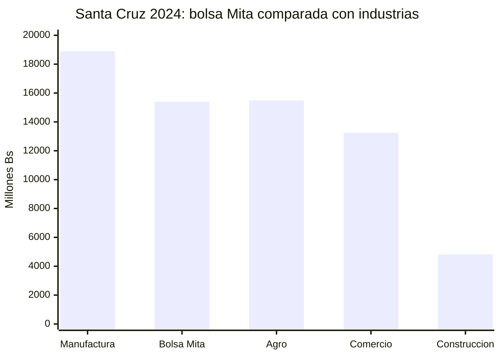
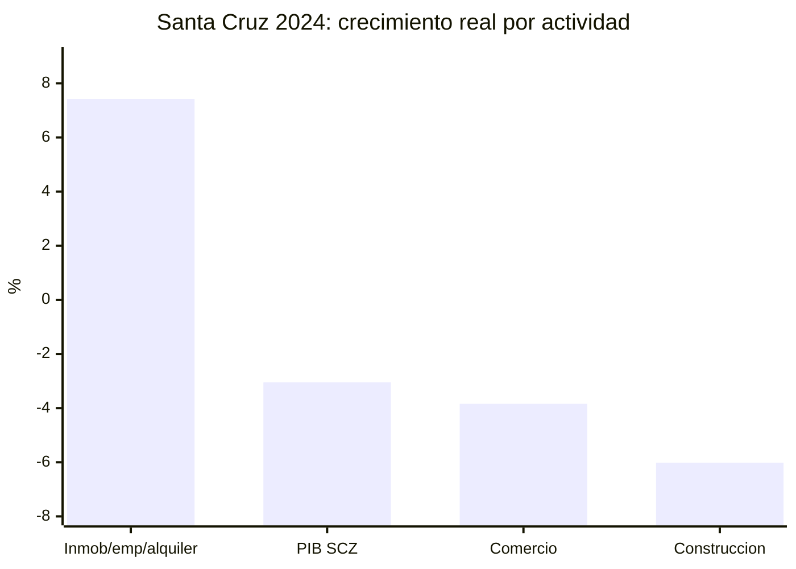
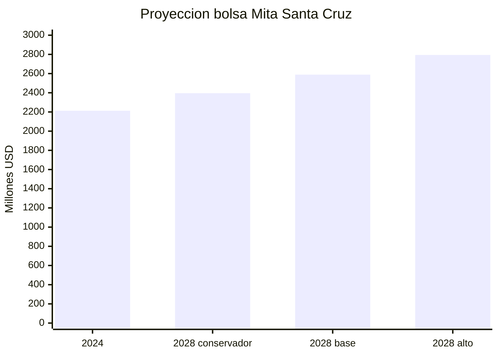
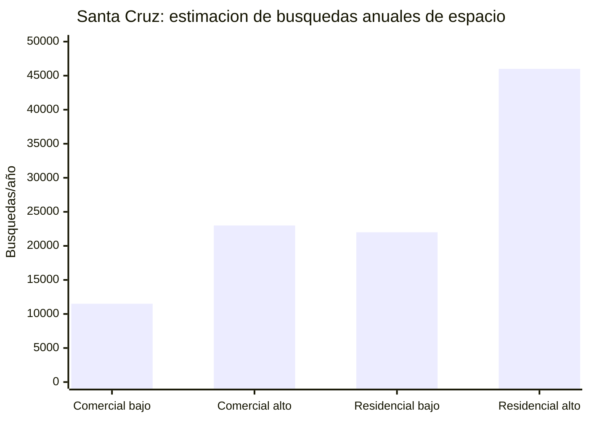
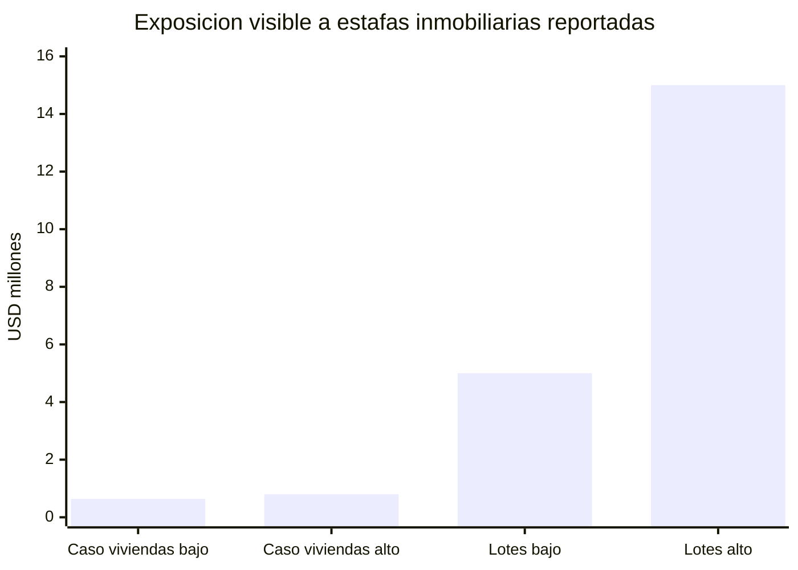
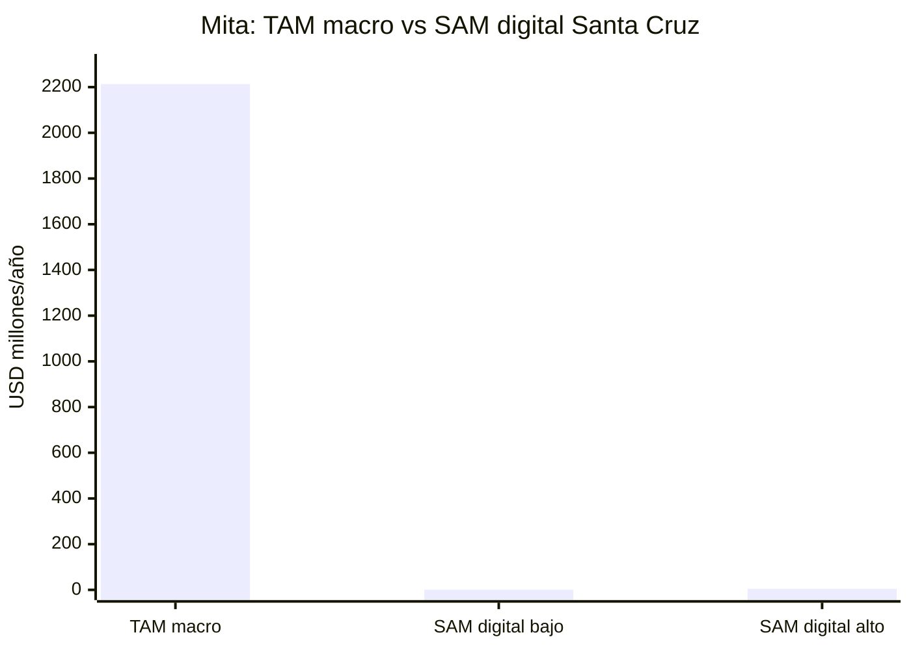
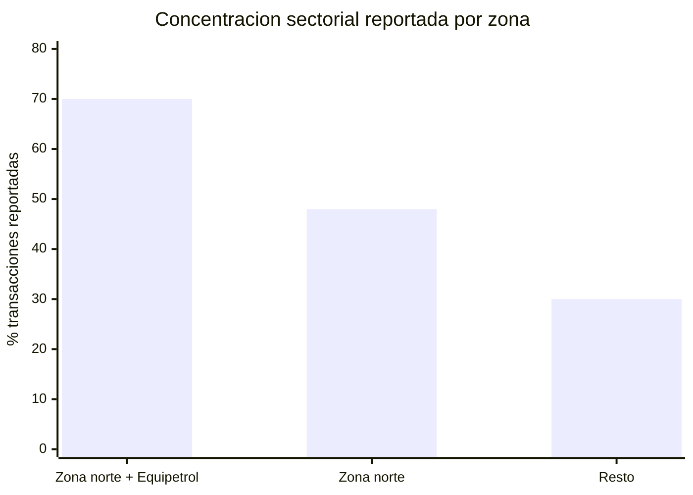

# Mita - Estadisticas de mercado, inferencias y argumentos fuertes

Fecha de investigacion: 2026-05-30

Este archivo convierte fuentes publicas en estadisticas accionables para el pitch de Mita. La regla es:

* **Dato observado:** cifra publicada por una fuente.
* **Inferencia Mita:** calculo propio a partir de datos observados.
* **Uso recomendado:** frase o grafica para pitch.

No presentar las inferencias como cifras oficiales. Presentarlas como estimaciones propias, con formula visible.

---

## 1. Tesis fuerte

Mita no ataca solo "buscar alquiler". Ataca una capa de informacion sobre una economia fisica grande:

> En Santa Cruz, construccion + actividades inmobiliarias, empresariales y de alquiler representan una bolsa economica estimada de **Bs 15.4 mil millones en 2024**, equivalente a **USD 2.21 mil millones** y **13.3% del PIB departamental**. Es casi tan grande como el agro cruceño y mayor que comercio.

Eso cambia la narrativa:

* No es un app de busqueda.
* Es infraestructura digital para decisiones sobre espacios.
* El mercado es grande, fragmentado, riesgoso y todavia poco estructurado.

---

## 2. Tamaño del mercado economico

### 2.1 Santa Cruz: bolsa inmobiliaria + construccion

**Dato observado INE Santa Cruz 2024:**

| Actividad | 2024, millones Bs | Participacion PIB SCZ |
| --- | ---: | ---: |
| PIB Santa Cruz | 115,658.2 | 100.0% |
| Actividades inmobiliarias, empresariales y de alquiler | 10,581.8 | 9.15% |
| Construccion | 4,821.7 | 4.17% |

**Inferencia Mita:**

```txt
Bolsa espacio/inmobiliaria SCZ =
Actividades inmobiliarias, empresariales y de alquiler + Construccion

= 10,581.8 + 4,821.7
= 15,403.5 millones Bs
= 2,213.1 millones USD, usando 6.96 Bs/USD
= 13.3% del PIB departamental
```

**Uso recomendado:**

> "Mita opera sobre una categoria de mas de USD 2.2 mil millones en Santa Cruz: el mercado fisico de espacios, alquileres, servicios inmobiliarios y construccion."

### 2.2 Comparacion contra otras industrias en Santa Cruz

**Dato observado INE Santa Cruz 2024:**

| Actividad | 2024, millones Bs | Relacion vs bolsa Mita |
| --- | ---: | ---: |
| Industrias manufactureras | 18,901.9 | Bolsa Mita = 81.5% de manufactura |
| Agricultura, ganaderia, silvicultura y pesca | 15,487.7 | Bolsa Mita = 99.5% de agro |
| Comercio | 13,242.9 | Bolsa Mita = 116.3% de comercio |
| Construccion + inmobiliarias/empresariales/alquiler | 15,403.5 | Base Mita |

**Inferencia Mita:**

```txt
Bolsa Mita / Agro = 15,403.5 / 15,487.7 = 99.5%
Bolsa Mita / Comercio = 15,403.5 / 13,242.9 = 116.3%
Bolsa Mita / Manufactura = 15,403.5 / 18,901.9 = 81.5%
```

**Uso recomendado:**

> "La economia de espacios en Santa Cruz es casi del tamaño del agro y mas grande que comercio. Ordenarla con IA tiene escala real."



### 2.3 Bolivia: tamaño nacional de la oportunidad

**Dato observado INE Bolivia 2024:**

| Actividad | 2024, millones Bs | Participacion PIB basico |
| --- | ---: | ---: |
| PIB a precios basicos | 275,535.8 | 100.0% |
| Inmuebles y servicios prestados a las empresas | 33,749.8 | 12.25% |
| Construccion | 9,325.4 | 3.38% |
| Industrias manufactureras | 33,192.3 | 12.05% |
| Comercio | 23,158.6 | 8.40% |

**Inferencia Mita nacional:**

```txt
Bolsa espacio/inmobiliaria Bolivia =
33,749.8 + 9,325.4
= 43,075.2 millones Bs
= 6,189.0 millones USD
= 15.63% del PIB basico
= 1.30x manufactura
= 1.86x comercio
```

**Uso recomendado:**

> "A nivel Bolivia, la bolsa inmobiliaria/espacios + construccion supera a manufactura y casi duplica comercio en valor agregado."

---

## 3. Crecimiento y ciclo

### 3.1 Santa Cruz: el espacio crece aunque el ciclo este duro

**Dato observado INE Santa Cruz, variacion real 2024:**

| Actividad | Variacion real 2024 |
| --- | ---: |
| PIB Santa Cruz | -3.05% |
| Construccion | -6.02% |
| Actividades inmobiliarias, empresariales y de alquiler | +7.42% |
| Comercio | -3.84% |
| Manufactura | -1.88% |

**Inferencia Mita:**

La construccion esta golpeada, pero el mercado de uso, alquiler, servicios e intermediacion de espacios no desaparece; al contrario, en 2024 crecio en terminos reales.

**Uso recomendado:**

> "Incluso cuando el PIB cruceño cayo y construccion retrocedio, las actividades inmobiliarias, empresariales y de alquiler crecieron 7.4% real. El problema no es falta de demanda: es informacion desordenada."



### 3.2 Tendencia nominal 2017-2024

**Dato observado INE Santa Cruz:**

| Actividad | 2017, millones Bs | 2024, millones Bs | CAGR nominal 2017-2024 |
| --- | ---: | ---: | ---: |
| PIB Santa Cruz | 95,419.7 | 115,658.2 | +2.79% |
| Actividades inmobiliarias, empresariales y de alquiler | 7,827.6 | 10,581.8 | +4.40% |
| Construccion | 5,415.9 | 4,821.7 | -1.65% |
| Comercio | 10,568.9 | 13,242.9 | +3.27% |
| Manufactura | 13,634.7 | 18,901.9 | +4.78% |

**Inferencia Mita:**

Las actividades inmobiliarias/empresariales/alquiler crecieron mas rapido que el PIB departamental entre 2017 y 2024.

---

## 4. Proyeccion 2028 de la bolsa Mita en Santa Cruz

Base 2024: **Bs 15,403.5 millones**.

| Escenario | CAGR 2024-2028 | Bolsa 2028, millones Bs | Bolsa 2028, millones USD |
| --- | ---: | ---: | ---: |
| Conservador | 2% | 16,673.3 | 2,395.6 |
| Base | 4% | 18,019.9 | 2,589.1 |
| Alto | 6% | 19,446.6 | 2,794.0 |

**Inferencia Mita:**

Si el mercado se normaliza y las actividades inmobiliarias mantienen un crecimiento moderado, la bolsa local de espacios puede moverse hacia **USD 2.4-2.8 mil millones** en 2028.



---

## 5. Demanda anual: cuantas busquedas puede ordenar Mita

### 5.1 Empresas que potencialmente necesitan espacios

**Dato observado SEPREC 2024:**

* Base empresarial Bolivia: 387,764 unidades economicas.
* Santa Cruz concentra 29.7%.
* Nuevas empresas Bolivia 2024: 15,001.
* Santa Cruz lidera nuevas inscripciones con 32.5%, equivalente a 4,872 segun SEPREC.

**Inferencia Mita:**

```txt
Empresas activas aproximadas en Santa Cruz =
387,764 * 29.7%
= 115,166 unidades economicas

Nuevas empresas Santa Cruz 2024 =
15,001 * 32.5%
= 4,875 nuevas empresas/año
= 13.4 nuevas empresas/dia
```

No todas necesitan local fisico. Escenarios:

| Supuesto | Busquedas comerciales/productivas por año |
| --- | ---: |
| 10% de empresas activas buscan, abren, relocalizan o comparan espacio | 11,517 |
| 15% | 17,275 |
| 20% | 23,033 |

**Uso recomendado:**

> "Solo con empresas formales, Santa Cruz puede generar entre 11 mil y 23 mil decisiones de espacio comercial/productivo al año."

### 5.2 Vivienda y alquiler como extension natural

**Dato observado ICE / Censo 2024 citado en prensa:**

* Santa Cruz de la Sierra: 662,680 viviendas.
* Region metropolitana: 827,408 viviendas.
* En Santa Cruz de la Sierra, 27.74% vive en alquiler.
* En la region metropolitana, 25.5% vive en alquiler.

**Inferencia Mita:**

```txt
Viviendas alquiladas ciudad SCZ =
662,680 * 27.74%
= 183,827 viviendas alquiladas

Viviendas alquiladas region metropolitana =
827,408 * 25.5%
= 210,989 viviendas alquiladas
```

Si 12%-25% de hogares alquilados cambian o buscan opcion cada año:

| Supuesto de rotacion anual | Busquedas residenciales/año, ciudad SCZ |
| --- | ---: |
| 12% | 22,059 |
| 15% | 27,574 |
| 20% | 36,765 |
| 25% | 45,957 |

### 5.3 Mercado anual de busquedas Mita

**Inferencia combinada conservadora-base:**

```txt
Busquedas comerciales/productivas: 11,500 - 23,000/año
Busquedas residenciales por rotacion: 22,000 - 46,000/año

Mercado anual de decisiones de espacio en SCZ:
33,500 - 69,000 busquedas/año
```

**Uso recomendado:**

> "Mita puede ordenar decenas de miles de decisiones de espacio por año solo en Santa Cruz."



---

## 6. Agentes inmobiliarios: red formal e independiente

### 6.1 Conteos observables

**Datos observados:**

* Century 21 Global lista **1,562 agentes** en Santa Cruz, Bolivia.
* CBDI Santa Cruz reporta que agrupa a **88 empresas desarrolladoras inmobiliarias** asociadas.
* RE/MAX Bolivia reporta una red nacional con oficinas y agentes asociados; una fuente sectorial reportaba 26 oficinas y mas de 300 agentes a nivel Bolivia en 2020.

**Inferencia Mita:**

El mercado no depende de una sola red. Hay:

* agentes de franquicia,
* brokers,
* asesores de desarrolladoras,
* inmobiliarias pequeñas,
* propietarios recurrentes,
* intermediarios independientes en Facebook/WhatsApp.

Escenarios defendibles para Santa Cruz:

| Categoria | Rango estimado | Razonamiento |
| --- | ---: | --- |
| Agentes visibles/formales en redes y agencias | 2,000 - 3,500 | Century 21 ya lista 1,562; se agregan otras redes, oficinas, agencias y desarrolladoras. |
| Intermediarios independientes o semi-formales | 1,500 - 3,500 | El mercado usa Facebook, WhatsApp y contactos personales; parte de la intermediacion no aparece en directorios. |
| Total agentes/intermediarios activos potenciales | 3,500 - 7,000 | Rango para dimensionar mercado B2B de Mita, no como dato oficial. |

**Densidad inferida:**

| Escenario | Agentes/intermediarios | Por 100,000 habitantes SCZ | Viviendas ciudad por agente |
| --- | ---: | ---: | ---: |
| Directorio Century 21 observado | 1,562 | 50.0 | 424 |
| Estimacion baja | 3,500 | 112.1 | 189 |
| Estimacion alta | 7,000 | 224.2 | 95 |

**Uso recomendado:**

> "Incluso tomando solo el directorio visible de Century 21, Santa Cruz ya muestra mas de 1,500 agentes. El mercado B2B de herramientas para agentes existe antes de escalar a toda Bolivia."

### 6.2 Dependientes vs independientes

No encontre un registro publico oficial de "agentes inmobiliarios dependientes vs independientes" para Santa Cruz.

**Inferencia Mita basada en modelo de negocio del sector:**

* Agentes dependientes o asalariados: **10%-25%**.
* Agentes independientes, comisionistas, franquiciados o semi-formales: **75%-90%**.

Formula de escenario sobre 3,500-7,000 agentes:

| Tipo | Rango estimado |
| --- | ---: |
| Dependientes / staff comercial fijo | 350 - 1,750 |
| Independientes / comisionistas / semi-formales | 2,625 - 6,300 |

**Uso recomendado:**

> "El cliente B2B natural de Mita no es solo la inmobiliaria grande; son miles de agentes que viven de leads, confianza y velocidad de respuesta."

---

## 7. Riesgo y estafas inmobiliarias

### 7.1 Casos publicos usados como lower bound

**Dato observado 1: caso de viviendas en Santa Cruz, 2024**

Medios reportaron 32 denuncias por presunta estafa vinculada a viviendas en Santa Cruz. Las victimas habrian entregado entre USD 20,000 y USD 25,000 cada una.

**Inferencia Mita:**

```txt
Exposicion minima caso 32 victimas =
32 * USD 20,000 = USD 640,000

Exposicion alta del mismo caso =
32 * USD 25,000 = USD 800,000
```

**Dato observado 2: urbanizacion/lotes en Santa Cruz**

Medios reportaron una urbanizacion con mas de 1,000 lotes presuntamente vendidos de forma irregular.

**Inferencia Mita:**

Como el precio por lote no esta reportado de forma uniforme, usar escenarios:

| Supuesto precio promedio por lote | Exposicion potencial |
| --- | ---: |
| USD 5,000 | USD 5.0 millones |
| USD 10,000 | USD 10.0 millones |
| USD 15,000 | USD 15.0 millones |

### 7.2 Indice Mita de exposicion visible a fraude

**Inferencia Mita con solo dos casos publicos:**

```txt
Exposicion visible minima =
USD 640,000 + USD 5,000,000
= USD 5.64 millones

Exposicion visible alta =
USD 800,000 + USD 15,000,000
= USD 15.8 millones
```

Esto no mide todo el fraude inmobiliario de Santa Cruz. Es un **lower bound narrativo**: lo que se puede mostrar con casos visibles de prensa.

**Uso recomendado:**

> "El problema no es solo perder tiempo: en Santa Cruz, casos publicos recientes muestran exposiciones potenciales de millones de dolares en decisiones inmobiliarias mal verificadas."



### 7.3 Como conecta con Mita

Mita no promete eliminar fraude legal. Pero puede reducir riesgo de informacion:

* alertar publicaciones sin datos clave,
* marcar falta de ubicacion clara,
* pedir documentos minimos antes de contacto,
* detectar inconsistencias de precio/zona/metros,
* separar fuente verificada de fuente no verificada,
* registrar trazabilidad de publicacion,
* generar checklist antes de pagar reserva, anticretico o adelanto.

---

## 8. NPS, satisfaccion y friccion de confianza

### 8.1 Lo que existe y lo que no existe

No encontre una fuente publica robusta con NPS especifico de inmobiliarias o agentes inmobiliarios en Santa Cruz/Bolivia.

Fuentes internacionales si muestran que la confianza, comunicacion y transparencia son variables criticas en la relacion cliente-agente. Tambien existen benchmarks externos donde la profesion de agente inmobiliario aparece con NPS bajo o reputacion tensionada, pero no deben presentarse como dato boliviano.

### 8.2 Proxy Mita de NPS de experiencia inmobiliaria

Para pitch se puede usar como **hipotesis cuantitativa a validar**, no como dato oficial:

```txt
NPS = % promotores - % detractores
```

Escenarios de experiencia de busqueda inmobiliaria en Santa Cruz:

| Escenario | Promotores | Pasivos | Detractores | NPS proxy |
| --- | ---: | ---: | ---: | ---: |
| Moderadamente frustrado | 25% | 35% | 40% | -15 |
| Friccion alta | 20% | 30% | 50% | -30 |
| Baja confianza | 15% | 30% | 55% | -40 |

**Uso recomendado:**

> "Nuestra hipotesis es que la experiencia actual de busqueda inmobiliaria tiene NPS negativo por informacion incompleta, tiempo perdido y baja confianza. Mita busca mover esa experiencia de -30 a positiva."

### 8.3 Mita Trust Friction Index

Indice propio de 0 a 100 para medir friccion antes/despues del producto.

Variables:

| Variable | Peso | Medicion |
| --- | ---: | --- |
| Publicacion incompleta | 25 | % sin m2, condiciones, zona exacta, servicios o uso permitido |
| Riesgo de fuente | 20 | fuente no verificada, duplicada o sin trazabilidad |
| Costo de comparacion | 20 | numero de publicaciones revisadas/manualidad |
| Claridad de contacto | 15 | WhatsApp/contacto verificable, respuesta, identidad |
| Compatibilidad con necesidad | 20 | si el espacio realmente sirve para el uso declarado |

**Formula:**

```txt
Trust Friction Index =
0.25*Incompletitud +
0.20*RiesgoFuente +
0.20*CostoComparacion +
0.15*ClaridadContactoInvertida +
0.20*NoCompatibilidad
```

**Hipotesis inicial para auditoria propia:**

* Mercado actual: 65-80/100 friccion.
* Con Mita MVP: 25-40/100 friccion.

La auditoria de 50-100 publicaciones debe llenar los valores reales.

---

## 9. TAM, SAM y monetizacion defendible

### 9.1 TAM macro local

**TAM macro Santa Cruz:**

```txt
Construccion + inmobiliarias/empresariales/alquiler =
USD 2.21 mil millones en 2024
```

Este TAM no es ingreso capturable por Mita. Es la economia sobre la que Mita organiza informacion.

### 9.2 SAM de capa digital/IA

Estimacion de ingresos anuales si Mita monetiza agentes, leads y publicaciones:

| Linea | Supuesto | SAM anual Santa Cruz |
| --- | --- | ---: |
| SaaS para agentes | 3,500-7,000 agentes * USD 10-30/mes | USD 420k - 2.52M |
| Leads calificados | 33,500-69,000 busquedas/año * 1.5-3 contactos * USD 3-10/lead | USD 151k - 2.07M |
| Mejora de publicaciones | 10,000-30,000 publicaciones/año * USD 1-5 | USD 10k - 150k |

**SAM local combinado estimado:**

```txt
USD 0.6M - 4.7M/año
```

**SOM inicial realista para MVP/post-hackathon:**

| Captura | Ingreso anual potencial |
| --- | ---: |
| 1% del SAM bajo | USD 6k/año |
| 5% del SAM bajo | USD 30k/año |
| 10% del SAM bajo | USD 60k/año |
| 5% del SAM alto | USD 235k/año |
| 10% del SAM alto | USD 470k/año |

**Uso recomendado:**

> "El mercado macro es de miles de millones, pero el negocio inicial de Mita es una capa digital de leads, confianza y datos: entre USD 0.6M y 4.7M anuales solo en Santa Cruz si logra adopcion B2B."

---

## 10. Graficas que conviene llevar al deck

### Grafica A - El mercado no es pequeño

Usar la grafica de seccion 2.2.

Mensaje:

> "La economia de espacios es comparable al agro cruceño."

### Grafica B - En crisis, inmobiliario/servicios crece

Usar la grafica de seccion 3.1.

Mensaje:

> "El dolor sigue vivo incluso en ciclo bajo."

### Grafica C - Busquedas anuales

Usar la grafica de seccion 5.3.

Mensaje:

> "Hay decenas de miles de decisiones de espacio al año."

### Grafica D - Riesgo de fraude visible

Usar la grafica de seccion 7.2.

Mensaje:

> "No ordenar informacion cuesta dinero real."

### Grafica E - TAM/SAM



Mensaje:

> "Mita no necesita capturar el mercado inmobiliario completo; monetiza una capa pequeña pero valiosa de datos, leads y confianza."

---

## 11. Pipeline y geografia de desarrollo inmobiliario

Esta seccion sirve para mostrar que el problema de Mita no es abstracto: hay proyectos, zonas calientes y demanda de oficinas, almacenes, vivienda y centros comerciales.

**Dato observado Economy / Cadecocruz / CBDI / IBCE, 2024:**

* A finales de 2023, la zona metropolitana de Santa Cruz tenia **125 edificios** en distintas etapas de construccion, considerando edificios desde cuatro plantas.
* CBDI destaco crecimiento de proyectos residenciales y comerciales por demanda de viviendas y oficinas, migracion y refugio patrimonial en bienes inmuebles.
* La demanda futura mencionada incluye viviendas, oficinas, almacenes y centros comerciales.
* IBCE/Century 21 señalo que **70% de las transacciones inmobiliarias** se concentraban en zona norte y Equipetrol; de ese total, **48%** correspondia a zona norte.
* La zona este mostraba un crecimiento de **100% en transacciones** entre primer y segundo trimestre, segun la misma nota sectorial.

**Inferencia Mita:**

Santa Cruz no necesita solamente mas inventario; necesita inteligencia sobre donde esta el inventario, para que uso sirve y que zonas estan concentrando actividad.

```txt
Pipeline visible = 125 edificios metropolitanos
Hotspots principales = Zona Norte + Equipetrol
Verticales de demanda = vivienda + oficinas + almacenes + centros comerciales
```

**Uso recomendado:**

> "Hay pipeline urbano y zonas calientes; Mita convierte ese crecimiento inmobiliario en informacion accionable para pymes, agentes y usuarios."



---

## 12. Como usar las imagenes de `research/`

Las imagenes recopiladas sirven como contexto macro LATAM, pero no son la evidencia principal de Mita.

Uso recomendado:

* `image3.png`: refuerza que LatAm pasa mucho tiempo en redes sociales. Usarla solo como contexto para explicar por que Facebook/WhatsApp importan.
* `image4.png` y `image5.png`: contexto de bajo crecimiento en LatAm; util para decir que la eficiencia importa.
* `image6.png`: riesgo sistemico y seguridad en LatAm; no conectarla directamente a estafas inmobiliarias salvo como entorno de confianza.
* `image7.png`, `image8.png`, `image9.png`: remesas y macro LatAm; baja relevancia directa para Mita.

Para el pitch de Mita conviene priorizar INE, SEPREC, ATT, DataReportal, ICE/Censo y casos locales de estafa.

---

## 13. Fuentes

### Fuentes primarias y oficiales

* INE Bolivia - PIB anual por actividad economica, serie historica 1980-2024: https://www.ine.gob.bo/index.php/estadisticas-economicas/pib-y-cuentas-nacionales/producto-interno-bruto-anual/serie-historica-del-producto-interno-bruto/
* INE Bolivia - descarga PIB corriente por actividad economica: https://nube.ine.gob.bo/index.php/s/Sx5vznBqGGGIuN2/download
* INE Bolivia - descarga PIB constante por actividad economica: https://nube.ine.gob.bo/index.php/s/5HukXcuvSj76wKo/download
* INE Bolivia - PIB departamental Santa Cruz: https://www.ine.gob.bo/referencia2017/pib_departamental.html
* INE Santa Cruz - PIB por actividad economica 2017-2024: https://www.ine.gob.bo/referencia2017/CUADROS/D.7.1.1.xlsx
* INE Santa Cruz - estructura del PIB por actividad economica 2017-2024: https://www.ine.gob.bo/referencia2017/CUADROS/D.7.1.2.xlsx
* INE Santa Cruz - variacion real del PIB por actividad economica 2017-2024: https://www.ine.gob.bo/referencia2017/CUADROS/D.7.2.3.xlsx
* SEPREC Memoria Anual 2024: https://www.seprec.gob.bo/wp-content/uploads/2025/10/Memoria-ANUAL-2024-2.pdf
* INE Censo 2024 Santa Cruz: https://cpv2024.ine.gob.bo/index.php/censo-2024-ocho-de-cada-10-crucenos-viven-en-areas-urbanas-del-departamento-de-santa-cruz/?pdf=30391
* DataReportal Digital 2026 Bolivia: https://datareportal.com/reports/digital-2026-bolivia
* ATT Estado de situacion telecomunicaciones 2024: https://www.att.gob.bo/sites/default/files/archivos_listados_pdf/2025-10-28/Estado%20de%20situacion%20de%20las%20telecomunicaciones%20en%20Bolivia%202024.pdf

### Fuentes sectoriales y prensa

* ICE/Censo vivienda Santa Cruz, nota El Deber: https://eldeber.com.bo/santa-cruz/la-capital-crucena-cuenta-con-662680-viviendas-de-las-cuales-un-2774-son-alquiladas_514844/
* Century 21 Global - agentes Santa Cruz Bolivia: https://www.century21global.com/es/agents?location=Bolivia%2CSanta-Cruz
* CBDI Santa Cruz - 88 empresas desarrolladoras asociadas: https://cbdi.com.bo/
* Economy / Cadecocruz / CBDI / IBCE - demanda, 125 edificios, zonas y transacciones: https://www.economy.com.bo/articulo/business/sector-inmobiliario-santa-cruz-experimenta-demanda-viviendas-mas-economicas/20240710102729014246.amp.html
* Vision360 - Caincruz advierte ralentizacion en ventas, alquileres y anticreticos: https://www.vision360.bo/noticias/2024/11/29/15975-el-sector-inmobiliario-cruceno-advierte-ralentizacion-cuesta-cerrar-ventas-y-alquileres
* Unitel - 32 denuncias por presunta estafa de viviendas en Santa Cruz: https://unitel.bo/noticias/seguridad/hay-32-denuncias-por-presunta-estafa-de-viviendas-en-santa-cruz-BC12247131
* El Dia - denuncia por urbanizacion/lotes presuntamente irregulares: https://eldia.com.bo/2024-07-16/sociedad/denuncian-a-una-urbanizacion-con-1000-lotes-ilegales-en-santa-cruz.html
* Los Tiempos - modus de estafa de anticretico inteligente: https://www.lostiempos.com/actualidad/pais/20240926/estafa-anticretico-inteligente-nuevo-modo-delictivo-que-acecha-quienes

### Benchmarks externos para NPS/satisfaccion, no Bolivia

* Real Estate News - survey on consumer trust/agent value: https://www.realestatenews.com/2024/09/18/survey-finds-room-for-improvement-on-consumer-trust-agent-value
* NAR - what buyers/sellers want from agents: https://www.nar.realtor/magazine/real-estate-news/sales-marketing/what-buyers-sellers-want-most-from-real-estate-agents
* Inman - agent career NPS benchmark: https://www.inman.com/2024/04/15/real-estate-agent-career-net-promoter-score-clocks-in-at-29/
