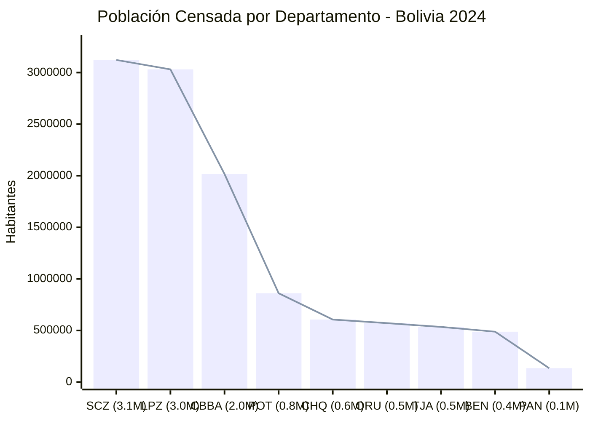
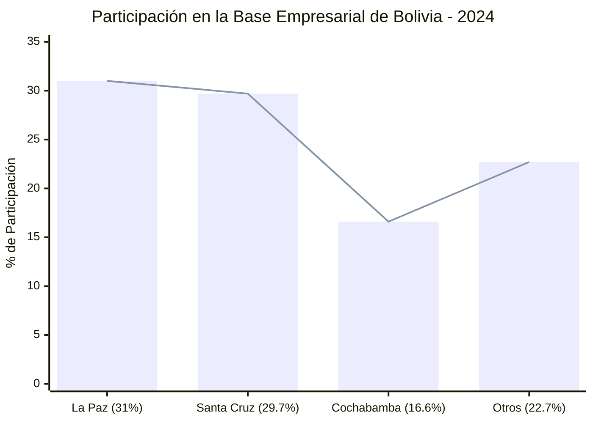
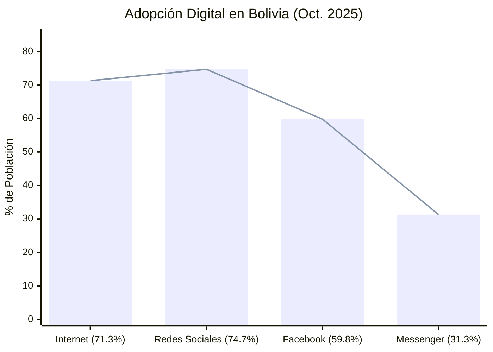
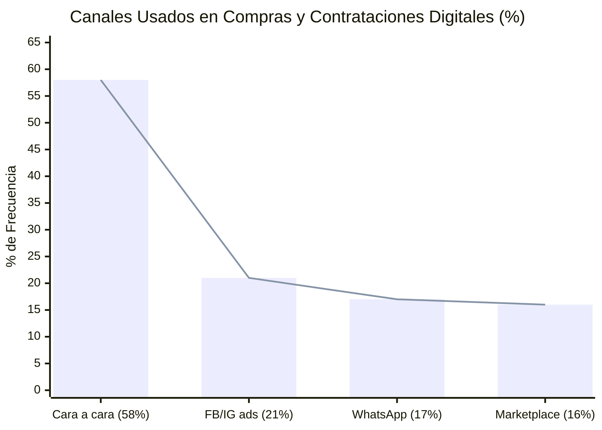
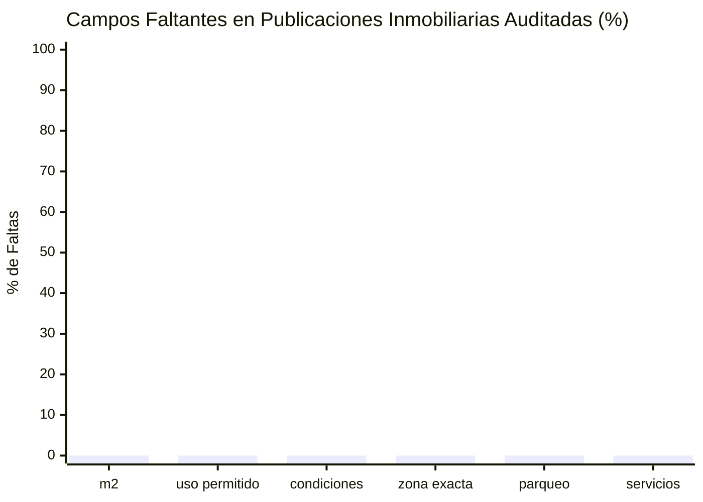

# Mita - Fuentes estadisticas y graficas para justificar el problema

Fecha de investigacion: 2026-05-30

Archivo complementario recomendado: `Mita_estadisticas_mercado_inferidas.md`, que convierte las fuentes en estimaciones propias de tamaño de mercado, crecimiento, agentes, riesgo de estafa, NPS proxy y TAM/SAM.

## Tesis que mejor sustenta a Mita

La version mas alineada con Build With AI 2026 es: Mita como agente inmobiliario con IA para encontrar espacios productivos, comerciales y logisticos en Santa Cruz. Este enfoque conecta con la mencion Industria porque ataca digitalizacion, logistica inteligente, automatizacion de informacion, eficiencia operativa y soporte a pymes/emprendedores.

El argumento fuerte no es solo "buscar alquiler es incomodo". El argumento fuerte es:

> En el departamento mas poblado y urbanizado de Bolivia, con alta concentracion empresarial y uso masivo de canales digitales/sociales, emprendedores y pymes todavia buscan espacios fisicos entre publicaciones dispersas, incompletas y dificiles de comparar. Mita convierte ese mercado informal y fragmentado en datos estructurados, recomendaciones explicables y contacto accionable.

## Fuentes clave

| Bloque | Dato util para pitch | Fuente |
| --- | --- | --- |
| Escala local | Resultados oficiales difundidos en 2025: Bolivia tiene 11.365.333 habitantes y Santa Cruz es el departamento mas poblado con 3.122.605 habitantes. | INE Censo 2024: https://cpv2024.ine.gob.bo/ |
| Urbanizacion SCZ | El INE reporta que Santa Cruz tiene 3.122.605 personas; 82,8% vive en zonas urbanas. Tambien reporta hogares con telefonia 87,2% e internet 82,5% en Santa Cruz. | INE Censo 2024 Santa Cruz: https://cpv2024.ine.gob.bo/index.php/censo-2024-ocho-de-cada-10-crucenos-viven-en-areas-urbanas-del-departamento-de-santa-cruz/?pdf=30391 |
| Actividad empresarial | La base empresarial de Bolivia crecio de 377.377 a 387.764 unidades economicas en 2024. La mayor concentracion esta en La Paz 31%, Santa Cruz 29,7% y Cochabamba 16,6%. | SEPREC Memoria 2024: https://www.seprec.gob.bo/wp-content/uploads/2025/10/Memoria-ANUAL-2024-2.pdf |
| Nuevas empresas | En 2024 se registraron 15.001 nuevas empresas; Santa Cruz lidero nuevas inscripciones con 32,5% y 4.872 unidades economicas. | SEPREC Memoria 2024: https://www.seprec.gob.bo/wp-content/uploads/2025/10/Memoria-ANUAL-2024-2.pdf |
| Sectores que necesitan espacios | Actividades principales en la base empresarial: comercio automotor/ventas y reparacion 34,7%, construccion 13,2%, industria manufacturera 10,4%, servicios profesionales y tecnicos 8,8%. | SEPREC Memoria 2024: https://www.seprec.gob.bo/wp-content/uploads/2025/10/Memoria-ANUAL-2024-2.pdf |
| Digitalizacion | Bolivia tenia 9,00 millones de usuarios de internet a octubre de 2025, penetracion 71,3%; 13,7 millones de conexiones moviles, equivalentes a 108% de la poblacion; 9,43 millones de identidades de redes sociales, 74,7% de la poblacion. | DataReportal Digital 2026 Bolivia: https://datareportal.com/reports/digital-2026-bolivia |
| Facebook como canal | Facebook tenia alcance publicitario de 7,55 millones de usuarios en Bolivia a fines de 2025, equivalente a 83,9% de la base local de internet. | DataReportal Digital 2026 Bolivia: https://datareportal.com/reports/digital-2026-bolivia |
| WhatsApp y apps de mensajeria | ATT atribuye la caida del trafico de voz movil al desplazamiento hacia apps como WhatsApp, Messenger, Duo, Telegram y plataformas por internet; el consumo mensual de voz por linea bajo 75,2% entre 2015 y 2024. | ATT Estado de situacion telecomunicaciones 2024: https://www.att.gob.bo/sites/default/files/archivos_listados_pdf/2025-10-28/Estado%20de%20situacion%20de%20las%20telecomunicaciones%20en%20Bolivia%202024.pdf |
| Comercio por redes | Estudio citado por Activo$ Bolivia/Ariadna: 98% de encuestados declaro uso frecuente de redes; 21% compro/contrato por anuncios en Facebook o Instagram, 17% fue contactado por WhatsApp y 16% por Marketplace; 58% aun ve necesario el encuentro cara a cara. | Bolivia Energia Libre / Ariadna: https://boliviaenergialibre.com/economia/estudio-revela-que-bolivianos-usan-whatsapp-facebook-e-instragram-para-cerrar-negocios-y-comprar-productos/ |
| Informalidad | FMI reporta que datos recientes de OIT apuntan a 85% del empleo en la economia informal en Bolivia. Esto respalda la hipotesis de procesos comerciales poco estructurados. | IMF Bolivia Article IV 2025: https://www.imf.org/-/media/files/publications/cr/2025/english/1bolea2025002-print-pdf.pdf |
| Pymes y digitalizacion | CEPAL senala que tecnologias 4.0 como IA, big data, cloud, marketing digital y ciberseguridad estan al alcance de pymes para mejorar comercio tradicional y electronico. | CEPAL 2024: https://www.cepal.org/es/publicaciones/68968-tecnologias-innovadoras-digitales-apoyo-la-participacion-pymes-comercio |
| Peso de pymes en LAC | OECD/CAF/SELA 2024: dentro de la economia formal, las pymes representan 99,5% de las empresas en LAC y las microempresas 88,4%. | SME Policy Index LAC 2024: https://www.oecd.org/content/dam/oecd/en/publications/reports/2024/07/sme-policy-index-latin-america-and-the-caribbean-2024_d0ab1c40/ba028c1d-en.pdf |
| Sector inmobiliario SCZ | Caincruz advirtio en nov. 2024 que ventas, alquileres y anticreticos se ralentizaron por incertidumbre economica. Util para explicar friccion comercial, no como dato estructural primario. | Vision360, Caincruz: https://www.vision360.bo/noticias/2024/11/29/15975-el-sector-inmobiliario-cruceno-advierte-ralentizacion-cuesta-cerrar-ventas-y-alquileres |
| Obras y zonas | Cadecocruz reporto 125 edificios en distintas etapas de construccion en zona metropolitana a fines de 2023; una nota basada en IBCE/Century 21 menciona concentracion de transacciones en zona norte y Equipetrol. Usar como evidencia sectorial secundaria. | Economy / Cadecocruz / IBCE: https://www.economy.com.bo/articulo/business/sector-inmobiliario-santa-cruz-experimenta-demanda-viviendas-mas-economicas/20240710102729014246.amp.html |

## Graficas recomendadas para el pitch

### 1. Santa Cruz es el mercado local correcto

Mensaje: Santa Cruz no es un caso pequeno; es el departamento mas poblado de Bolivia.

Fuente: INE Censo 2024, resultados oficiales difundidos en 2025.

### 2. Santa Cruz concentra actividad empresarial

Mensaje: la busqueda de espacios productivos importa porque Santa Cruz concentra casi un tercio de la base empresarial boliviana.

Fuente: SEPREC Memoria 2024.

### 3. El problema vive en canales digitales y sociales

Mensaje: los usuarios ya estan en internet, redes y Facebook; Mita organiza lo que hoy esta disperso.

Fuente: DataReportal Digital 2026 Bolivia. Nota: Facebook/Messenger son alcance publicitario, no usuarios activos unicos.

### 4. La oportunidad es ordenar informacion antes del contacto fisico

Mensaje: en Bolivia los canales digitales influyen la compra, pero el cierre/contacto sigue mezclando redes, WhatsApp y presencialidad.

Fuente: Ariadna/Activo$ Bolivia citado por Bolivia Energia Libre. Nota: muestra de 554 encuestas en seis ciudades; usar como evidencia cualitativa-cuantitativa, no como cifra censal.

## Frases listas para pitch

- "Santa Cruz es el departamento mas poblado de Bolivia y ocho de cada diez crucenos viven en areas urbanas; el problema de encontrar espacios adecuados es urbano, local y masivo."
- "Santa Cruz concentra cerca del 30% de la base empresarial boliviana y lidero las nuevas inscripciones empresariales en 2024; por eso enfocar Mita en locales, oficinas, depositos, galpones y talleres conecta directamente con pymes y actividad productiva."
- "El mercado ya es digital en la superficie: internet, Facebook y WhatsApp son canales cotidianos. Pero la informacion inmobiliaria sigue sin estructura: precio, zona, metros, acceso, servicios y condiciones aparecen incompletos o dispersos."
- "Mita no reemplaza el contacto humano ni WhatsApp; llega antes para estructurar la necesidad, comparar opciones y convertir mensajes desordenados en leads calificados."

## Evidencia que aun conviene levantar con datos propios

No encontre una fuente publica robusta que mida especificamente "porcentaje de publicaciones inmobiliarias incompletas en Santa Cruz". Para cerrar esa brecha, conviene hacer una auditoria rapida propia antes de la presentacion:

1. Tomar 100 publicaciones de alquiler/anticretico/venta de Facebook Marketplace, grupos, portales e inmobiliarias.
2. Etiquetar campos faltantes: precio, moneda, zona exacta, metros, servicios, parqueo, expensas/condiciones, contacto, tipo de uso permitido.
3. Reportar porcentajes simples: "% sin metros", "% sin condiciones", "% sin zona clara", "% sin uso permitido", "% duplicadas o desactualizadas".
4. Usar esa auditoria como evidencia primaria del equipo Mita.

Grafica sugerida para esa auditoria:

Reemplazar los ceros con el resultado real de la auditoria.
